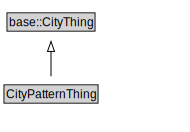

# CityPatternThing

<a href="../../diagrams/CityPattern__CityPatternThing.dot.svg">Open interactive CityPatternThing diagram</a>

## Specializations of CityPatternThing

| Class | Description |
|-------|-------------|
| [City (5087-2)](5087-2__City.md) |  |
| [City Administrative Area (5087-2)](5087-2__CityAdministrativeArea.md) |  |
| [Jurisdictional Area (5087-2)](5087-2__JurisdictionalArea.md) |  |

## Formalization for CityPatternThing

| Property | Constraint |
|----------|------------|
| subClassOf | base::CityThing |

