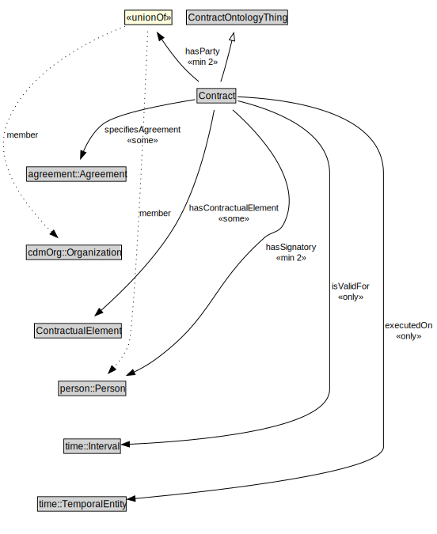

# Contract

<a href="../../diagrams/Contract__Contract.dot.svg">Open interactive Contract diagram</a>

## Formalization for Contract

| Property | Constraint |
|----------|------------|
| executedOn | all time::TemporalEntity |
| hasContractualElement | some ContractualElement |
| hasParty | min 2 owl::Thing |
| hasSignatory | min 2 owl::Thing |
| isValidFor | all time::Interval |
| specifiesAgreement | some agreement::Agreement |
| subClassOf | ContractOntologyThing |

## Used by classes

| Class | Property |
|-------|----------|
| [Contractual Element (Contract)](Contract__ContractualElement.md) | N49dfadc528f64ce0956d701ef76aeacb |

